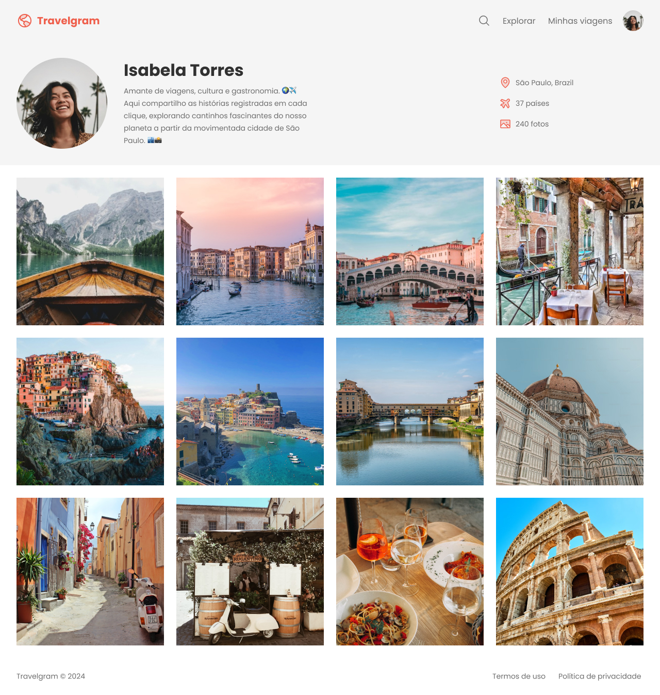

<h1 align="center"> Travelgram </h1>

Projeto desenvolvido no curso Full Stack da Rocketseat.

  <a href="#-tecnologias">Tecnologias</a>&nbsp;&nbsp;&nbsp;|&nbsp;&nbsp;&nbsp;
  <a href="#-projeto">Projeto</a>&nbsp;&nbsp;&nbsp;|&nbsp;&nbsp;&nbsp;
  <a href="#-layout">Layout</a>&nbsp;&nbsp;&nbsp;|&nbsp;&nbsp;&nbsp;
  <a href="#memo-licença">Licença</a>

  

 

## 🚀 Tecnologias

Esse projeto foi desenvolvido com as seguintes tecnologias:

- HTML e CSS
- Git e Github
- Figma

## 💻 Projeto

O Travelgram é um blog para postar fotos das suas viagens, nesse projeto desenvolvemos a página do perfil com Nome, descrição e informações usuário e na sequência os registros fotográficos das viagens. O aprendizado com este projeto engloba a disposição dos elementos via CSS, instruções para construção de um menu e estruturação dos arquivos e variáveis CSS.

## 🔖 Layout

Você pode visualizar o layout do projeto através [DESSE LINK](<https://www.figma.com/design/QYryOKeysZQUyebqjTLj0R/Perfil-de-viagens-(Community)?node-id=3-811&t=qCyuSgXu7sxU8aTs-0>). É necessário ter conta no [Figma](https://figma.com) para acessá-lo.

## :memo: Licença

Esse projeto está sob a licença MIT.

---

Feito com ♥ by Rocketseat :wave: [Participe da nossa comunidade!](https://discord.gg/rocketseat)